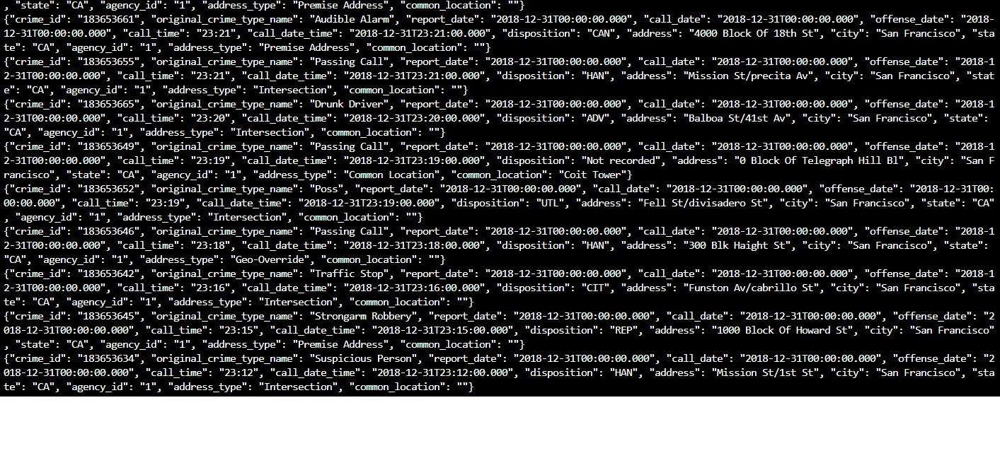

# udacity-stream-data-project-SFCrime
## Introduction
The aim of the project is to create an Streaming application with Spark that connects to a Kafka cluster, and provide statistical analyses of the data using Apache Spark Structured Streaming. 
## Requirements

* Java 1.8.x
* Scala 2.11.x
* Spark 2.4.x
* Kafka
* Python 3.6 or above

Packages required:
* findspark
* pyspark
* python-dateutil
* pathlib

## Steps to Execute :
1. Start the server:

Run `/usr/bin/zookeeper-server-start config/zookeeper.properties`

Run `/usr/bin/kafka-server-start config/server.properties` in another termination window.

2. Install packages:

Run `python kafka_server.py`

3. Insert data into topic:

Run `python kafka_server.py`

4. Kafka consumer:

Run `kafka-console-consumer --topic "com.udacity.police-calls" --from-beginning --bootstrap-server localhost:9092`, the output is:

## Questions

Q1 - How did changing values on the SparkSession property parameters affect the throughput and latency of the data?

Answer: Modifying the parameters including `inputRowsPerSecond`, `numInputRecords` and `processedRowsPerSecond`

Q2 - What were the 2-3 most efficient SparkSession property key/value pairs? Through testing multiple variations on values, how can you tell these were the most optimal?

Answer: Hypertuning over the parameters `spark.sql.shuffle.partitions`, `spark.streaming.kafka.maxRatePerPartition` and `spark.default.parallelism`

- `"spark.default.parallelism" : 3` 
- `"spark.sql.shuffle.partitions":10`
- `"spark.streaming.kafka.maxRatePerPartition":10`
